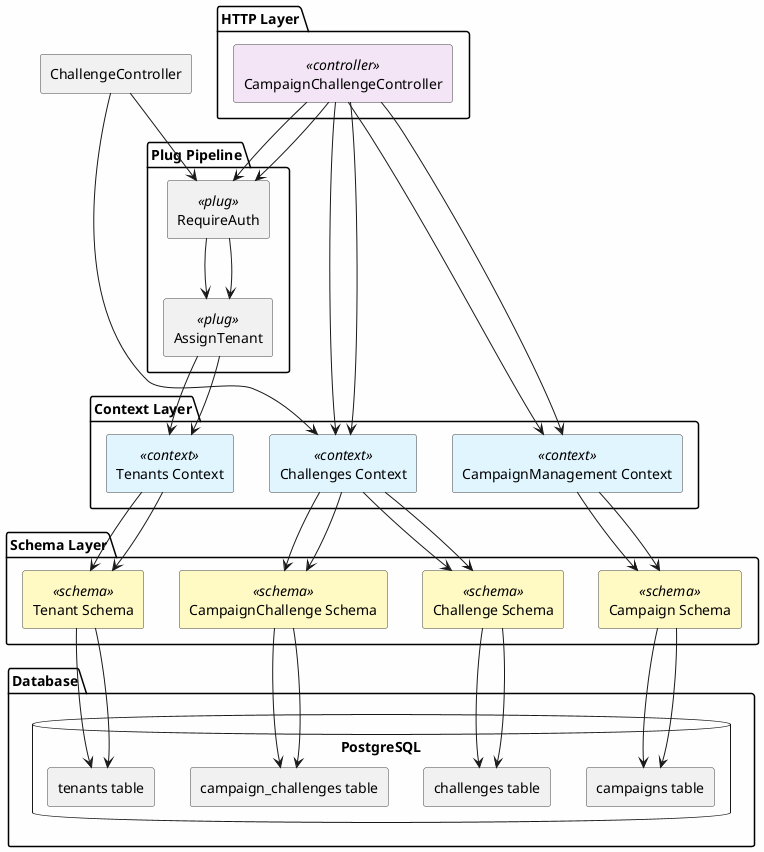
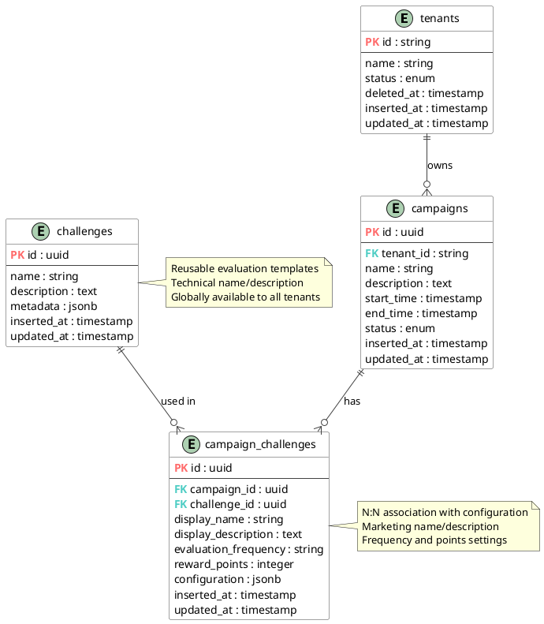
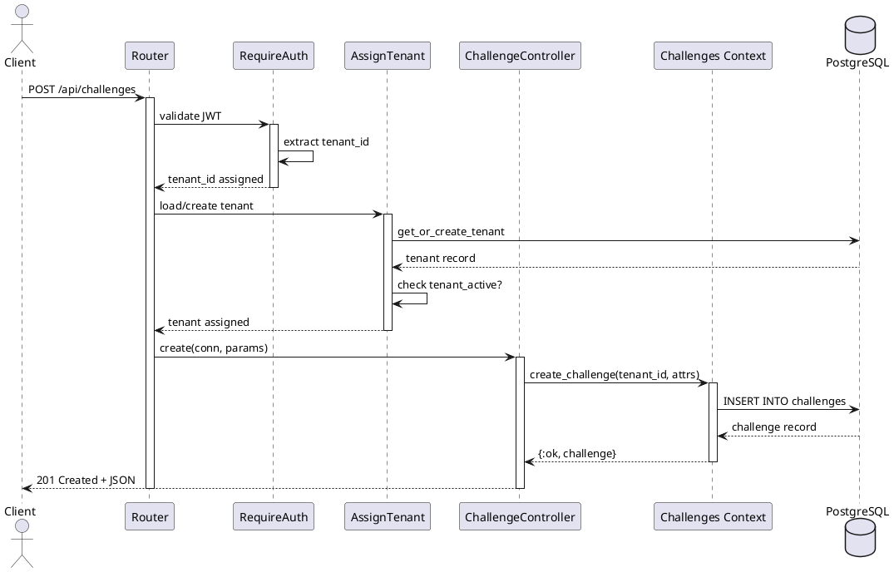

# Design Document: Challenge System

## Overview

The Challenge System extends the Campaign Management API by introducing reusable evaluation mechanisms that can be associated with campaigns. Challenges define "what to evaluate" while Campaign Challenges define "how to evaluate it for a specific campaign" including frequency, points, and custom naming.

This design follows a separation of concerns where:
- **Challenges** are globally available, reusable evaluation templates visible to all tenants
- **Campaign Challenges** are the configured instances linking challenges to campaigns with tenant isolation through campaign ownership
- Future iterations will implement the actual evaluation logic using macros and queues

### Key Design Decisions

1. **N:N Relationship**: Challenges and Campaigns have a many-to-many relationship through campaign_challenges
2. **Global Challenge Visibility**: Challenges are not tenant-scoped; any tenant can use any challenge
3. **Tenant Isolation via Campaigns**: Campaign challenges maintain tenant isolation through the campaign relationship
4. **Configuration Flexibility**: JSONB fields for metadata and configuration enable future extensibility
5. **Cascade Rules**: Campaign deletion cascades to associations; Challenge deletion is restricted if associations exist
6. **Naming Clarity**: 
   - `Challenge.name` = Technical name (e.g., "TransactionsChecker")
   - `CampaignChallenge.display_name` = Marketing name (e.g., "Buy+")
7. **Frequency Format**: String-based to support cron expressions and keywords
8. **Points System**: Integer allowing positive (rewards) and negative (penalties)
9. **Challenge Management**: Challenges managed through context functions only (no HTTP endpoints)
10. **API Exposure**: Only Campaign Challenge associations are exposed via HTTP endpoints

## Architecture

### System Components Diagram




### Entity Relationship Diagram



### Request Flow Diagram



## Components and Interfaces

### Challenges Context


```elixir
defmodule CampaignsManagmentApi.Challenges do
  @moduledoc """
  Context for managing challenges and campaign challenge associations.
  
  Challenges are reusable evaluation mechanisms that can be associated
  with multiple campaigns. Each association includes specific configuration
  for evaluation frequency, reward points, and display information.
  """
  
  import Ecto.Query
  alias CampaignsManagmentApi.Repo
  alias CampaignsManagmentApi.Challenges.{Challenge, CampaignChallenge}
  alias CampaignsManagmentApi.Pagination
  
  @type pagination_opts :: [limit: pos_integer(), cursor: DateTime.t() | nil]
  @type pagination_result :: %{
    data: [Challenge.t() | CampaignChallenge.t()],
    cursor: DateTime.t() | nil,
    has_more: boolean()
  }
  
  # Challenge Operations
  
  @spec list_challenges(pagination_opts()) :: pagination_result()
  def list_challenges(opts \\ []) do
    query = from c in Challenge
    Pagination.paginate(Repo, query, opts)
  end
  
  @spec get_challenge(Ecto.UUID.t()) :: Challenge.t() | nil
  def get_challenge(challenge_id) do
    Repo.get(Challenge, challenge_id)
  end
  
  @spec create_challenge(map()) :: {:ok, Challenge.t()} | {:error, Ecto.Changeset.t()}
  def create_challenge(attrs) do
    %Challenge{}
    |> Challenge.changeset(attrs)
    |> Repo.insert()
  end
  
  @spec update_challenge(Ecto.UUID.t(), map()) :: 
    {:ok, Challenge.t()} | {:error, :not_found | Ecto.Changeset.t()}
  def update_challenge(challenge_id, attrs) do
    case get_challenge(challenge_id) do
      nil -> {:error, :not_found}
      challenge ->
        challenge
        |> Challenge.changeset(attrs)
        |> Repo.update()
    end
  end
  
  @spec delete_challenge(Ecto.UUID.t()) :: 
    {:ok, Challenge.t()} | {:error, :not_found | :has_associations}
  def delete_challenge(challenge_id) do
    case get_challenge(challenge_id) do
      nil -> 
        {:error, :not_found}
      challenge ->
        if has_campaign_associations?(challenge.id) do
          {:error, :has_associations}
        else
          Repo.delete(challenge)
        end
    end
  end
  
  # Campaign Challenge Operations
  
  @spec list_campaign_challenges(String.t(), Ecto.UUID.t(), pagination_opts()) :: 
    pagination_result()
  def list_campaign_challenges(tenant_id, campaign_id, opts \\ []) do
    query = from cc in CampaignChallenge,
      join: c in assoc(cc, :campaign),
      where: c.tenant_id == ^tenant_id and cc.campaign_id == ^campaign_id,
      preload: [:challenge]
    
    Pagination.paginate(Repo, query, opts)
  end
  
  @spec get_campaign_challenge(String.t(), Ecto.UUID.t(), Ecto.UUID.t()) :: 
    CampaignChallenge.t() | nil
  def get_campaign_challenge(tenant_id, campaign_id, campaign_challenge_id) do
    from(cc in CampaignChallenge,
      join: c in assoc(cc, :campaign),
      where: c.tenant_id == ^tenant_id 
        and cc.campaign_id == ^campaign_id 
        and cc.id == ^campaign_challenge_id,
      preload: [:challenge]
    )
    |> Repo.one()
  end
  
  @spec create_campaign_challenge(String.t(), Ecto.UUID.t(), map()) :: 
    {:ok, CampaignChallenge.t()} | {:error, :campaign_not_found | Ecto.Changeset.t()}
  def create_campaign_challenge(tenant_id, campaign_id, attrs) do
    with {:ok, campaign} <- validate_campaign_ownership(tenant_id, campaign_id) do
      %CampaignChallenge{}
      |> CampaignChallenge.changeset(Map.put(attrs, :campaign_id, campaign_id))
      |> Repo.insert()
    end
  end
  
  @spec update_campaign_challenge(String.t(), Ecto.UUID.t(), Ecto.UUID.t(), map()) :: 
    {:ok, CampaignChallenge.t()} | {:error, :not_found | Ecto.Changeset.t()}
  def update_campaign_challenge(tenant_id, campaign_id, campaign_challenge_id, attrs) do
    case get_campaign_challenge(tenant_id, campaign_id, campaign_challenge_id) do
      nil -> {:error, :not_found}
      campaign_challenge ->
        campaign_challenge
        |> CampaignChallenge.changeset(attrs)
        |> Repo.update()
    end
  end
  
  @spec delete_campaign_challenge(String.t(), Ecto.UUID.t(), Ecto.UUID.t()) :: 
    {:ok, CampaignChallenge.t()} | {:error, :not_found}
  def delete_campaign_challenge(tenant_id, campaign_id, campaign_challenge_id) do
    case get_campaign_challenge(tenant_id, campaign_id, campaign_challenge_id) do
      nil -> {:error, :not_found}
      campaign_challenge -> Repo.delete(campaign_challenge)
    end
  end
  
  # Private Helpers
  
  @spec has_campaign_associations?(Ecto.UUID.t()) :: boolean()
  defp has_campaign_associations?(challenge_id) do
    Repo.exists?(from cc in CampaignChallenge, where: cc.challenge_id == ^challenge_id)
  end
  
  @spec validate_campaign_ownership(String.t(), Ecto.UUID.t()) :: 
    {:ok, Campaign.t()} | {:error, :campaign_not_found}
  defp validate_campaign_ownership(tenant_id, campaign_id) do
    case Repo.get_by(CampaignsManagmentApi.CampaignManagement.Campaign, 
                     id: campaign_id, tenant_id: tenant_id) do
      nil -> {:error, :campaign_not_found}
      campaign -> {:ok, campaign}
    end
  end
end
```

### Challenge Schema

```elixir
defmodule CampaignsManagmentApi.Challenges.Challenge do
  @moduledoc """
  Schema for reusable challenge evaluation mechanisms.
  
  Challenges define the technical evaluation logic that can be
  associated with multiple campaigns by any tenant. The actual evaluation
  implementation will be registered automatically in future iterations.
  """
  
  use Ecto.Schema
  import Ecto.Changeset
  
  @primary_key {:id, :binary_id, autogenerate: true}
  @foreign_key_type :binary_id
  @derive {Jason.Encoder, only: [:id, :name, :description, 
                                   :metadata, :inserted_at, :updated_at]}
  
  @type t :: %__MODULE__{
    id: Ecto.UUID.t(),
    name: String.t(),
    description: String.t() | nil,
    metadata: map() | nil,
    campaign_challenges: [CampaignChallenge.t()] | Ecto.Association.NotLoaded.t(),
    inserted_at: DateTime.t(),
    updated_at: DateTime.t()
  }
  
  schema "challenges" do
    field :name, :string
    field :description, :string
    field :metadata, :map
    
    has_many :campaign_challenges, CampaignsManagmentApi.Challenges.CampaignChallenge
    
    timestamps(type: :utc_datetime)
  end
  
  @spec changeset(t(), map()) :: Ecto.Changeset.t()
  def changeset(challenge, attrs) do
    challenge
    |> cast(attrs, [:name, :description, :metadata])
    |> validate_required([:name])
    |> validate_length(:name, min: 3)
  end
end
```

### CampaignChallenge Schema

```elixir
defmodule CampaignsManagmentApi.Challenges.CampaignChallenge do
  @moduledoc """
  Schema for challenge-campaign associations with configuration.
  
  Represents the N:N relationship between challenges and campaigns,
  storing campaign-specific configuration including evaluation frequency,
  reward points, and marketing-friendly display information.
  """
  
  use Ecto.Schema
  import Ecto.Changeset
  
  @primary_key {:id, :binary_id, autogenerate: true}
  @foreign_key_type :binary_id
  @derive {Jason.Encoder, only: [:id, :campaign_id, :challenge_id, 
                                   :display_name, :display_description,
                                   :evaluation_frequency, :reward_points,
                                   :configuration, :inserted_at, :updated_at]}
  
  @type t :: %__MODULE__{
    id: Ecto.UUID.t(),
    campaign_id: Ecto.UUID.t(),
    challenge_id: Ecto.UUID.t(),
    display_name: String.t(),
    display_description: String.t() | nil,
    evaluation_frequency: String.t(),
    reward_points: integer(),
    configuration: map() | nil,
    campaign: Campaign.t() | Ecto.Association.NotLoaded.t(),
    challenge: Challenge.t() | Ecto.Association.NotLoaded.t(),
    inserted_at: DateTime.t(),
    updated_at: DateTime.t()
  }
  
  @frequency_keywords ~w(daily weekly monthly on_event)
  
  schema "campaign_challenges" do
    field :display_name, :string
    field :display_description, :string
    field :evaluation_frequency, :string
    field :reward_points, :integer
    field :configuration, :map
    
    belongs_to :campaign, CampaignsManagmentApi.CampaignManagement.Campaign
    belongs_to :challenge, CampaignsManagmentApi.Challenges.Challenge
    
    timestamps(type: :utc_datetime)
  end
  
  @spec changeset(t(), map()) :: Ecto.Changeset.t()
  def changeset(campaign_challenge, attrs) do
    campaign_challenge
    |> cast(attrs, [:campaign_id, :challenge_id, :display_name, 
                    :display_description, :evaluation_frequency, 
                    :reward_points, :configuration])
    |> validate_required([:campaign_id, :challenge_id, :display_name, 
                          :evaluation_frequency, :reward_points])
    |> validate_length(:display_name, min: 3)
    |> validate_evaluation_frequency()
    |> validate_number(:reward_points, message: "must be an integer")
    |> unique_constraint([:campaign_id, :challenge_id], 
                         name: :campaign_challenges_campaign_id_challenge_id_index)
    |> foreign_key_constraint(:campaign_id)
    |> foreign_key_constraint(:challenge_id)
  end
  
  @spec validate_evaluation_frequency(Ecto.Changeset.t()) :: Ecto.Changeset.t()
  defp validate_evaluation_frequency(changeset) do
    frequency = get_field(changeset, :evaluation_frequency)
    
    cond do
      is_nil(frequency) ->
        changeset
      
      frequency in @frequency_keywords ->
        changeset
      
      valid_cron_expression?(frequency) ->
        changeset
      
      true ->
        add_error(changeset, :evaluation_frequency, 
                  "must be a valid cron expression or one of: #{Enum.join(@frequency_keywords, ", ")}")
    end
  end
  
  @spec valid_cron_expression?(String.t()) :: boolean()
  defp valid_cron_expression?(expression) do
    parts = String.split(expression, " ")
    length(parts) == 5
  end
end
```


### Controllers

#### CampaignChallengeController

```elixir
defmodule CampaignsManagmentApiWeb.CampaignChallengeController do
  use CampaignsManagmentApiWeb, :controller
  alias CampaignsManagmentApi.Challenges
  
  def index(conn, %{"campaign_id" => campaign_id} = params) do
    tenant_id = conn.assigns.tenant.id
    opts = [
      limit: parse_int(params["limit"]),
      cursor: parse_datetime(params["cursor"])
    ]
    
    result = Challenges.list_campaign_challenges(tenant_id, campaign_id, opts)
    json(conn, result)
  end
  
  def show(conn, %{"campaign_id" => campaign_id, "id" => id}) do
    tenant_id = conn.assigns.tenant.id
    
    case Challenges.get_campaign_challenge(tenant_id, campaign_id, id) do
      nil -> send_not_found(conn)
      campaign_challenge -> json(conn, campaign_challenge)
    end
  end
  
  def create(conn, %{"campaign_id" => campaign_id} = params) do
    tenant_id = conn.assigns.tenant.id
    
    case Challenges.create_campaign_challenge(tenant_id, campaign_id, params) do
      {:ok, campaign_challenge} ->
        conn
        |> put_status(:created)
        |> json(campaign_challenge)
      {:error, :campaign_not_found} ->
        send_not_found(conn, "Campaign not found")
      {:error, changeset} ->
        send_validation_error(conn, changeset)
    end
  end
  
  def update(conn, %{"campaign_id" => campaign_id, "id" => id} = params) do
    tenant_id = conn.assigns.tenant.id
    
    case Challenges.update_campaign_challenge(tenant_id, campaign_id, id, params) do
      {:ok, campaign_challenge} -> json(conn, campaign_challenge)
      {:error, :not_found} -> send_not_found(conn)
      {:error, changeset} -> send_validation_error(conn, changeset)
    end
  end
  
  def delete(conn, %{"campaign_id" => campaign_id, "id" => id}) do
    tenant_id = conn.assigns.tenant.id
    
    case Challenges.delete_campaign_challenge(tenant_id, campaign_id, id) do
      {:ok, _} -> send_resp(conn, :no_content, "")
      {:error, :not_found} -> send_not_found(conn)
    end
  end
  
  defp send_not_found(conn, message \\ "Campaign challenge not found") do
    conn
    |> put_status(:not_found)
    |> json(%{error: message})
  end
  
  defp send_validation_error(conn, changeset) do
    conn
    |> put_status(:unprocessable_entity)
    |> json(%{errors: translate_errors(changeset)})
  end
  
  defp translate_errors(changeset) do
    Ecto.Changeset.traverse_errors(changeset, fn {msg, opts} ->
      Enum.reduce(opts, msg, fn {key, value}, acc ->
        String.replace(acc, "%{#{key}}", to_string(value))
      end)
    end)
  end
  
  defp parse_int(nil), do: nil
  defp parse_int(str) when is_binary(str), do: String.to_integer(str)
  defp parse_int(int) when is_integer(int), do: int
  
  defp parse_datetime(nil), do: nil
  defp parse_datetime(str) when is_binary(str) do
    case DateTime.from_iso8601(str) do
      {:ok, dt, _} -> dt
      _ -> nil
    end
  end
end
```

### Database Migrations

```elixir
# priv/repo/migrations/TIMESTAMP_create_challenges.exs
defmodule CampaignsManagmentApi.Repo.Migrations.CreateChallenges do
  use Ecto.Migration
  
  def change do
    create table(:challenges, primary_key: false) do
      add :id, :binary_id, primary_key: true
      add :name, :string, null: false
      add :description, :text
      add :metadata, :jsonb
      
      timestamps(type: :utc_datetime)
    end
    
    create index(:challenges, [:id])
  end
end

# priv/repo/migrations/TIMESTAMP_create_campaign_challenges.exs
defmodule CampaignsManagmentApi.Repo.Migrations.CreateCampaignChallenges do
  use Ecto.Migration
  
  def change do
    create table(:campaign_challenges, primary_key: false) do
      add :id, :binary_id, primary_key: true
      add :campaign_id, references(:campaigns, type: :binary_id, on_delete: :delete_all), null: false
      add :challenge_id, references(:challenges, type: :binary_id, on_delete: :restrict), null: false
      add :display_name, :string, null: false
      add :display_description, :text
      add :evaluation_frequency, :string, null: false
      add :reward_points, :integer, null: false
      add :configuration, :jsonb
      
      timestamps(type: :utc_datetime)
    end
    
    create index(:campaign_challenges, [:campaign_id, :challenge_id])
    create unique_index(:campaign_challenges, [:campaign_id, :challenge_id])
  end
end
```

### Router Configuration

```elixir
defmodule CampaignsManagmentApiWeb.Router do
  use CampaignsManagmentApiWeb, :router
  
  pipeline :api do
    plug :accepts, ["json"]
  end
  
  pipeline :authenticated do
    plug CampaignsManagmentApiWeb.Plugs.RequireAuth
    plug CampaignsManagmentApiWeb.Plugs.AssignTenant
  end
  
  scope "/api", CampaignsManagmentApiWeb do
    pipe_through [:api, :authenticated]
    
    resources "/campaigns", CampaignController, except: [:new, :edit] do
      resources "/challenges", CampaignChallengeController, except: [:new, :edit]
    end
  end
end
```


## Correctness Properties

### Property 1: Challenge Global Availability

*For any* challenge created in the system, it should be retrievable and usable by any tenant when associating with their campaigns.

**Validates: Requirements 1.3, 6.3**

### Property 2: Challenge Name Validation

*For any* challenge creation or update, names with fewer than 3 characters should be rejected, and names with 3 or more characters should be accepted.

**Validates: Requirements 1.2**

### Property 3: Campaign Challenge Unique Association

*For any* campaign and challenge pair, attempting to create duplicate associations should fail with a unique constraint error.

**Validates: Requirements 2.5**

### Property 4: Evaluation Frequency Validation

*For any* campaign challenge, the evaluation_frequency must be either a valid cron expression (5 parts) or one of the predefined keywords (daily, weekly, monthly, on_event).

**Validates: Requirements 5.1, 5.2, 5.3**

### Property 5: Reward Points Flexibility

*For any* campaign challenge, reward_points can be any integer value including positive, negative, or zero.

**Validates: Requirements 6.1, 6.2**

### Property 6: Challenge Deletion Protection

*For any* challenge that has campaign associations, deletion attempts should fail with an error indicating active associations.

**Validates: Requirements 3.5, 8.2, 8.3**

### Property 7: Campaign Challenge Cascade Deletion

*For any* campaign that is deleted, all associated campaign_challenges records should be automatically deleted.

**Validates: Requirements 8.1**

### Property 8: Campaign Ownership Validation

*For any* attempt to associate a challenge with a campaign from a different tenant, the operation should fail with a not found error (campaign not found for that tenant).

**Validates: Requirements 6.3, 6.4**

### Property 9: Metadata and Configuration Flexibility

*For any* valid JSON structure, challenges.metadata and campaign_challenges.configuration should accept and store the data correctly.

**Validates: Requirements 9.1, 9.2, 9.3**

### Property 10: Campaign Challenge Response Schema

*For any* campaign challenge retrieved or created, the response should include all fields: id, campaign_id, challenge_id, display_name, display_description, evaluation_frequency, reward_points, configuration, inserted_at, updated_at.

**Validates: Requirements 4.1, 4.2, 4.3, 4.4, 9.4**

## Testing Strategy

### Code Quality Requirements

**Static Analysis**:
- Run `mix credo --strict` at the end of implementation and fix all warnings/errors
- Run `mix dialyzer` at the end of implementation and fix all type warnings
- Ensure zero warnings before considering implementation complete

**Type Specifications**:
- All public functions MUST have @spec annotations
- All schemas MUST have @type definitions for their structs
- All keyword list options MUST be typed using @type
- All error responses MUST be typed (e.g., `{:ok, Challenge.t()} | {:error, Ecto.Changeset.t()}`)
- Use `@typedoc` to document complex types

**Test Setup**:
- Use ExMachina for all test data setup
- Define factories in `test/support/factory.ex`
- Use `insert/1`, `build/1`, and `params_for/1` helpers in tests
- Avoid manual struct creation in tests

### Dual Testing Approach

**Unit Tests**: Focus on specific examples, edge cases, and business logic
- Challenge CRUD operations
- Campaign challenge CRUD operations
- Validation rules (name length, frequency format, points)
- Cascade deletion behavior
- Association uniqueness
- Cross-tenant access prevention

**Property-Based Tests**: Verify universal properties across all inputs
- Minimum 100 iterations per property test
- Each test tagged with: **Feature: challenge-system, Property N: [property text]**
- Use StreamData for Elixir property testing
- Generate random valid and invalid inputs

### Test Data Generation

**ExMachina Factories**:
```elixir
def challenge_factory do
  %Challenge{
    id: Ecto.UUID.generate(),
    name: "Challenge #{System.unique_integer([:positive])}",
    description: "Description for challenge",
    metadata: %{"type" => "evaluation"}
  }
end

def campaign_challenge_factory do
  %CampaignChallenge{
    id: Ecto.UUID.generate(),
    campaign_id: Ecto.UUID.generate(),
    challenge_id: Ecto.UUID.generate(),
    display_name: "Buy+ Challenge",
    display_description: "Earn points for purchases",
    evaluation_frequency: "daily",
    reward_points: 100,
    configuration: %{"threshold" => 10}
  }
end
```

**StreamData Generators**:
```elixir
def challenge_name_generator, do: StreamData.string(:alphanumeric, min_length: 3)

def evaluation_frequency_generator do
  StreamData.one_of([
    StreamData.member_of(["daily", "weekly", "monthly", "on_event"]),
    cron_expression_generator()
  ])
end

def cron_expression_generator do
  StreamData.bind(StreamData.list_of(StreamData.string(:alphanumeric, length: 1), length: 5), fn parts ->
    StreamData.constant(Enum.join(parts, " "))
  end)
end

def reward_points_generator, do: StreamData.integer(-1000..1000)

def json_metadata_generator do
  StreamData.map_of(
    StreamData.string(:alphanumeric, min_length: 1),
    StreamData.one_of([
      StreamData.string(:alphanumeric),
      StreamData.integer(),
      StreamData.boolean()
    ])
  )
end
```

### Test Organization

```
test/
├── campaigns_api/
│   └── challenges/
│       ├── challenge_test.exs (unit tests)
│       ├── challenge_property_test.exs (property tests)
│       ├── campaign_challenge_test.exs (unit tests)
│       └── campaign_challenge_property_test.exs (property tests)
├── campaigns_api_web/
│   └── controllers/
│       ├── challenge_controller_test.exs (integration tests)
│       └── campaign_challenge_controller_test.exs (integration tests)
└── support/
    ├── factory.ex (add challenge factories)
    └── generators.ex (add challenge generators)
```

### Key Test Scenarios

**Challenge CRUD**:
- Create challenge with valid data → Success
- Create challenge with name < 3 chars → 422
- Update challenge → Success
- Delete challenge without associations → 204
- Delete challenge with associations → 422
- Any tenant can retrieve any challenge → Success

**Campaign Challenge CRUD**:
- Associate challenge with campaign → Success
- Duplicate association → 422 (unique constraint)
- Associate challenge with different tenant's campaign → 404 (campaign not found)
- Update frequency and points → Success
- Delete association → 204
- Campaign deletion cascades to associations

**Validation**:
- Valid cron expressions accepted
- Invalid cron expressions rejected
- Predefined keywords accepted
- Positive, negative, zero points accepted
- Valid JSON in metadata/configuration accepted

**Data Isolation**:
- Challenges are globally visible to all tenants
- Tenant A cannot associate challenges with Tenant B's campaigns
- Campaign ownership enforces tenant isolation for campaign challenges

## Error Handling

### Error Response Format

```json
{
  "error": "Human-readable error message",
  "errors": {
    "field_name": ["validation error 1", "validation error 2"]
  }
}
```

### HTTP Status Codes

- **200 OK**: Successful GET, PUT operations
- **201 Created**: Successful POST operations
- **204 No Content**: Successful DELETE operations
- **401 Unauthorized**: Missing or invalid authentication
- **403 Forbidden**: Tenant not active
- **404 Not Found**: Resource not found or cross-tenant access
- **422 Unprocessable Entity**: Validation errors or constraint violations
- **500 Internal Server Error**: Unexpected errors

### Specific Error Cases

**Challenge Deletion with Associations**:
```json
{
  "error": "Cannot delete challenge with active campaign associations"
}
```

**Invalid Evaluation Frequency**:
```json
{
  "errors": {
    "evaluation_frequency": ["must be a valid cron expression or one of: daily, weekly, monthly, on_event"]
  }
}
```

**Duplicate Association**:
```json
{
  "errors": {
    "campaign_id": ["has already been taken"]
  }
}
```

## Future Considerations

### Evaluation Implementation (Future Iteration)

The actual challenge evaluation logic will be implemented using:
- **Macros**: For automatic challenge registration
- **Queues**: For asynchronous evaluation processing (Oban or similar)
- **Evaluation Results**: New table to store evaluation outcomes
- **Participant Points**: Integration with points/rewards system

### Example Future Challenge Implementation

```elixir
defmodule CampaignsManagmentApi.Challenges.Implementations.TransactionsChecker do
  use CampaignsManagmentApi.Challenges.Implementation
  
  @challenge_name "TransactionsChecker"
  @challenge_description "Evaluates participant transaction behavior"
  
  def evaluate(participant_id, campaign_challenge) do
    # Implementation logic here
    # Returns {:ok, points_earned} or {:error, reason}
  end
end
```

This design keeps the schema and associations ready for future evaluation logic without coupling the data model to specific implementations.
