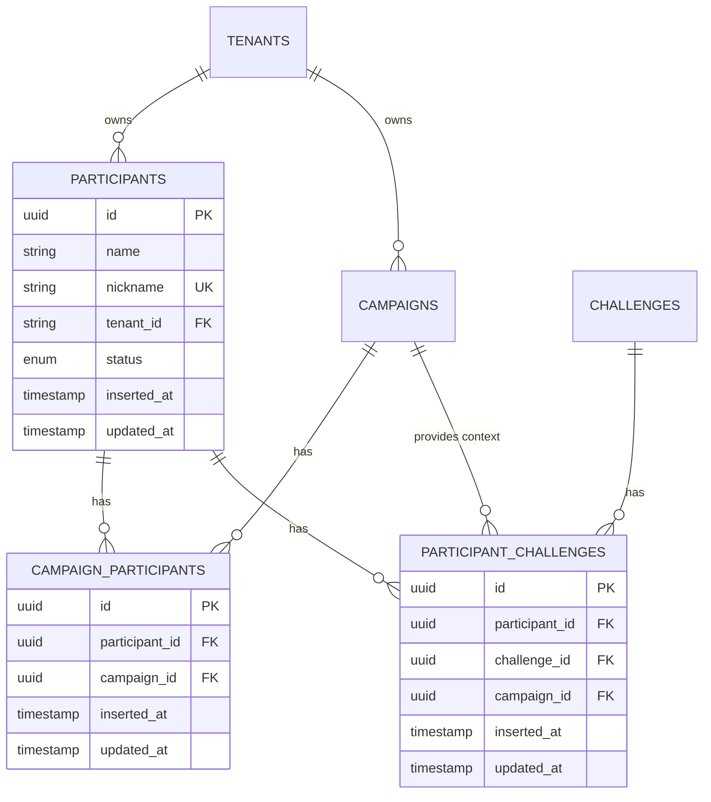

# Design Document: Participant Management System

## Overview

The Participant Management System provides comprehensive participant lifecycle management within a multi-tenant environment. The system enables tenants to create, manage, and associate participants with campaigns and challenges while maintaining strict tenant isolation and data security.

### Key Features

- **Participant CRUD Operations**: Full lifecycle management of participant records
- **Tenant Isolation**: Strict data separation ensuring participants can only access their tenant's data
- **Campaign Associations**: Many-to-many relationships between participants and campaigns
- **Challenge Associations**: Granular control over which challenges participants can access within campaigns
- **Cursor-Based Pagination**: Efficient pagination for large datasets using timestamp cursors
- **Status Management**: Track participant eligibility with active, inactive, and ineligible states
- **Unique Identification**: Nickname-based unique identification across all participants
- **RESTful API**: Comprehensive API endpoints with Swagger documentation

### Design Principles

1. **Tenant Isolation First**: Every query and operation validates tenant ownership
2. **Consistency with Existing Patterns**: Follows established patterns from campaign and challenge management
3. **Type Safety**: Comprehensive type specifications for all functions and data structures
4. **Validation at Boundaries**: Input validation at changeset level with clear error messages
5. **Efficient Pagination**: Reuse existing pagination module for consistent behavior
6. **Association Integrity**: Cascade deletions and validation to maintain referential integrity

## Architecture

### System Components

```
┌─────────────────────────────────────────────────────────────┐
│                     API Layer (Phoenix)                      │
│  ┌────────────────────────────────────────────────────────┐ │
│  │         ParticipantController (REST + Swagger)         │ │
│  └────────────────────────────────────────────────────────┘ │
└───────────────────────────┬─────────────────────────────────┘
                            │
┌───────────────────────────▼─────────────────────────────────┐
│                   Context Layer (Business Logic)             │
│  ┌────────────────────────────────────────────────────────┐ │
│  │              ParticipantManagement Context             │ │
│  │  • CRUD Operations                                     │ │
│  │  • Association Management                              │ │
│  │  • Tenant Validation                                   │ │
│  │  • Pagination                                          │ │
│  └────────────────────────────────────────────────────────┘ │
└───────────────────────────┬─────────────────────────────────┘
                            │
┌───────────────────────────▼─────────────────────────────────┐
│                    Schema Layer (Data Models)                │
│  ┌──────────────┐  ┌──────────────────┐  ┌───────────────┐ │
│  │ Participant  │  │ CampaignParticip │  │ Participant   │ │
│  │              │  │      ant         │  │   Challenge   │ │
│  └──────────────┘  └──────────────────┘  └───────────────┘ │
└───────────────────────────┬─────────────────────────────────┘
                            │
┌───────────────────────────▼─────────────────────────────────┐
│                   Database Layer (PostgreSQL)                │
│  • participants table                                        │
│  • campaign_participants table                               │
│  • participant_challenges table                              │
└─────────────────────────────────────────────────────────────┘
```

### Data Flow

1. **Request Flow**: HTTP Request → Controller → Context → Schema → Database
2. **Response Flow**: Database → Schema → Context → Controller → HTTP Response
3. **Tenant Validation**: Injected at context layer, validated before any database operation
4. **Association Validation**: Checked at context layer before creating associations

### Module Organization

```
lib/campaigns_api/
├── participant_management/
│   ├── participant.ex              # Participant schema
│   ├── campaign_participant.ex     # Campaign-Participant association schema
│   └── participant_challenge.ex    # Participant-Challenge association schema
├── participant_management.ex       # Context module with business logic
└── ...

lib/campaigns_api_web/
├── controllers/
│   └── participant_controller.ex   # REST API controller
└── ...
```

## Components and Interfaces

### 1. Participant Schema

**Module**: `CampaignsApi.ParticipantManagement.Participant`

**Purpose**: Represents an individual who can participate in campaigns and challenges within a tenant.

**Fields**:
- `id` (UUID): Primary key, auto-generated
- `name` (String): Full name of the participant, required, minimum 1 character
- `nickname` (String): Unique identifier, required, minimum 3 characters, unique across all participants
- `tenant_id` (String): Foreign key to tenant, required for tenant isolation
- `status` (Enum): Current status - `:active`, `:inactive`, or `:ineligible`, defaults to `:active`
- `inserted_at` (DateTime): Creation timestamp
- `updated_at` (DateTime): Last update timestamp

**Associations**:
- `belongs_to :tenant` - Each participant belongs to one tenant
- `has_many :campaign_participants` - Participant can be in multiple campaigns
- `has_many :participant_challenges` - Participant can be assigned to multiple challenges

**Validations**:
- Name: required, minimum 1 character
- Nickname: required, minimum 3 characters, unique constraint
- Tenant ID: required, foreign key constraint
- Status: must be one of the enum values

**Type Specification**:
```elixir
@type t :: %__MODULE__{
  id: Ecto.UUID.t(),
  name: String.t(),
  nickname: String.t(),
  tenant_id: String.t(),
  status: :active | :inactive | :ineligible,
  tenant: CampaignsApi.Tenants.Tenant.t() | Ecto.Association.NotLoaded.t(),
  campaign_participants: [CampaignParticipant.t()] | Ecto.Association.NotLoaded.t(),
  participant_challenges: [ParticipantChallenge.t()] | Ecto.Association.NotLoaded.t(),
  inserted_at: DateTime.t(),
  updated_at: DateTime.t()
}
```

### 2. CampaignParticipant Schema

**Module**: `CampaignsApi.ParticipantManagement.CampaignParticipant`

**Purpose**: Join table managing many-to-many relationship between participants and campaigns.

**Fields**:
- `id` (UUID): Primary key, auto-generated
- `participant_id` (UUID): Foreign key to participants table, required
- `campaign_id` (UUID): Foreign key to campaigns table, required
- `inserted_at` (DateTime): Association creation timestamp
- `updated_at` (DateTime): Last update timestamp

**Associations**:
- `belongs_to :participant` - References the participant
- `belongs_to :campaign` - References the campaign

**Constraints**:
- Unique constraint on `(participant_id, campaign_id)` combination
- Foreign key constraints on both participant_id and campaign_id
- On delete: cascade (when participant or campaign is deleted, association is removed)

**Type Specification**:
```elixir
@type t :: %__MODULE__{
  id: Ecto.UUID.t(),
  participant_id: Ecto.UUID.t(),
  campaign_id: Ecto.UUID.t(),
  participant: Participant.t() | Ecto.Association.NotLoaded.t(),
  campaign: Campaign.t() | Ecto.Association.NotLoaded.t(),
  inserted_at: DateTime.t(),
  updated_at: DateTime.t()
}
```

### 3. ParticipantChallenge Schema

**Module**: `CampaignsApi.ParticipantManagement.ParticipantChallenge`

**Purpose**: Join table managing many-to-many relationship between participants and challenges, with campaign context.

**Fields**:
- `id` (UUID): Primary key, auto-generated
- `participant_id` (UUID): Foreign key to participants table, required
- `challenge_id` (UUID): Foreign key to challenges table, required
- `campaign_id` (UUID): Foreign key to campaigns table, required for context
- `inserted_at` (DateTime): Association creation timestamp
- `updated_at` (DateTime): Last update timestamp

**Associations**:
- `belongs_to :participant` - References the participant
- `belongs_to :challenge` - References the challenge
- `belongs_to :campaign` - References the campaign for context

**Constraints**:
- Unique constraint on `(participant_id, challenge_id)` combination
- Foreign key constraints on participant_id, challenge_id, and campaign_id
- On delete: cascade (when participant, challenge, or campaign is deleted, association is removed)

**Type Specification**:
```elixir
@type t :: %__MODULE__{
  id: Ecto.UUID.t(),
  participant_id: Ecto.UUID.t(),
  challenge_id: Ecto.UUID.t(),
  campaign_id: Ecto.UUID.t(),
  participant: Participant.t() | Ecto.Association.NotLoaded.t(),
  challenge: Challenge.t() | Ecto.Association.NotLoaded.t(),
  campaign: Campaign.t() | Ecto.Association.NotLoaded.t(),
  inserted_at: DateTime.t(),
  updated_at: DateTime.t()
}
```

### 4. ParticipantManagement Context

**Module**: `CampaignsApi.ParticipantManagement`

**Purpose**: Business logic layer providing all participant management operations with tenant isolation.

**Public Functions**:

#### Participant CRUD Operations

```elixir
@spec list_participants(tenant_id(), pagination_opts()) :: pagination_result()
```
Lists participants for a tenant with cursor-based pagination and optional nickname filtering.

```elixir
@spec get_participant(tenant_id(), participant_id()) :: Participant.t() | nil
```
Retrieves a single participant by ID within the tenant.

```elixir
@spec create_participant(tenant_id(), attrs()) :: 
  {:ok, Participant.t()} | {:error, Ecto.Changeset.t()}
```
Creates a new participant for the tenant.

```elixir
@spec update_participant(tenant_id(), participant_id(), attrs()) :: 
  {:ok, Participant.t()} | {:error, :not_found | Ecto.Changeset.t()}
```
Updates an existing participant within the tenant.

```elixir
@spec delete_participant(tenant_id(), participant_id()) :: 
  {:ok, Participant.t()} | {:error, :not_found}
```
Deletes a participant and all associated campaign and challenge associations.

#### Campaign-Participant Association Operations

```elixir
@spec associate_participant_with_campaign(tenant_id(), participant_id(), campaign_id()) :: 
  {:ok, CampaignParticipant.t()} | {:error, :tenant_mismatch | Ecto.Changeset.t()}
```
Creates an association between a participant and a campaign, validating tenant ownership.

```elixir
@spec disassociate_participant_from_campaign(tenant_id(), participant_id(), campaign_id()) :: 
  {:ok, CampaignParticipant.t()} | {:error, :not_found}
```
Removes the association between a participant and a campaign, also removing all related challenge associations.

```elixir
@spec list_campaigns_for_participant(tenant_id(), participant_id(), pagination_opts()) :: 
  pagination_result()
```
Lists all campaigns a participant is enrolled in with pagination.

```elixir
@spec list_participants_for_campaign(tenant_id(), campaign_id(), pagination_opts()) :: 
  pagination_result()
```
Lists all participants enrolled in a campaign with pagination.

#### Participant-Challenge Association Operations

```elixir
@spec associate_participant_with_challenge(tenant_id(), participant_id(), challenge_id()) :: 
  {:ok, ParticipantChallenge.t()} | 
  {:error, :tenant_mismatch | :participant_not_in_campaign | Ecto.Changeset.t()}
```
Creates an association between a participant and a challenge, validating tenant ownership and campaign membership.

```elixir
@spec disassociate_participant_from_challenge(tenant_id(), participant_id(), challenge_id()) :: 
  {:ok, ParticipantChallenge.t()} | {:error, :not_found}
```
Removes the association between a participant and a challenge.

```elixir
@spec list_challenges_for_participant(tenant_id(), participant_id(), pagination_opts()) :: 
  pagination_result()
```
Lists all challenges a participant is enrolled in with optional campaign filtering.

```elixir
@spec list_participants_for_challenge(tenant_id(), challenge_id(), pagination_opts()) :: 
  pagination_result()
```
Lists all participants enrolled in a specific challenge with pagination.

**Type Definitions**:
```elixir
@type tenant_id :: String.t()
@type participant_id :: Ecto.UUID.t()
@type campaign_id :: Ecto.UUID.t()
@type challenge_id :: Ecto.UUID.t()
@type attrs :: map()
@type pagination_opts :: [
  limit: pos_integer(),
  cursor: DateTime.t() | nil,
  nickname: String.t() | nil,
  campaign_id: Ecto.UUID.t() | nil
]
@type pagination_result :: %{
  data: [struct()],
  next_cursor: DateTime.t() | nil,
  has_more: boolean()
}
```

### 5. ParticipantController

**Module**: `CampaignsApiWeb.ParticipantController`

**Purpose**: REST API controller exposing participant management endpoints with Swagger documentation.

**Endpoints**:

| Method | Path | Action | Description |
|--------|------|--------|-------------|
| POST | `/api/participants` | `create` | Create a new participant |
| GET | `/api/participants` | `index` | List participants with pagination |
| GET | `/api/participants/:id` | `show` | Get a specific participant |
| PUT | `/api/participants/:id` | `update` | Update a participant |
| DELETE | `/api/participants/:id` | `delete` | Delete a participant |
| POST | `/api/participants/:participant_id/campaigns/:campaign_id` | `associate_campaign` | Associate participant with campaign |
| DELETE | `/api/participants/:participant_id/campaigns/:campaign_id` | `disassociate_campaign` | Remove campaign association |
| GET | `/api/participants/:participant_id/campaigns` | `list_campaigns` | List campaigns for participant |
| GET | `/api/campaigns/:campaign_id/participants` | `list_participants` | List participants for campaign |
| POST | `/api/participants/:participant_id/challenges/:challenge_id` | `associate_challenge` | Associate participant with challenge |
| DELETE | `/api/participants/:participant_id/challenges/:challenge_id` | `disassociate_challenge` | Remove challenge association |
| GET | `/api/participants/:participant_id/challenges` | `list_challenges` | List challenges for participant |
| GET | `/api/challenges/:challenge_id/participants` | `list_challenge_participants` | List participants for challenge |

**Swagger Configuration**:
- `use PhoenixSwagger` immediately after `use CampaignsApiWeb, :controller`
- `swagger_definitions/0` function defining all schemas
- `swagger_path` documentation for each endpoint

**Schema Definitions**:
- `Participant`: Full participant representation
- `ParticipantRequest`: Request body for create/update
- `ParticipantListResponse`: Paginated list response
- `CampaignParticipant`: Association representation
- `ParticipantChallenge`: Challenge association representation
- `ErrorResponse`: Standard error response
- `ValidationErrorResponse`: Validation error details

## Data Models

### Database Schema

#### participants Table

```sql
CREATE TABLE participants (
  id UUID PRIMARY KEY DEFAULT gen_random_uuid(),
  name VARCHAR(255) NOT NULL CHECK (length(name) >= 1),
  nickname VARCHAR(255) NOT NULL UNIQUE CHECK (length(nickname) >= 3),
  tenant_id VARCHAR(255) NOT NULL REFERENCES tenants(id) ON DELETE CASCADE,
  status VARCHAR(20) NOT NULL DEFAULT 'active' CHECK (status IN ('active', 'inactive', 'ineligible')),
  inserted_at TIMESTAMP NOT NULL DEFAULT NOW(),
  updated_at TIMESTAMP NOT NULL DEFAULT NOW()
);

CREATE INDEX idx_participants_tenant_id ON participants(tenant_id);
CREATE INDEX idx_participants_nickname ON participants(nickname);
CREATE INDEX idx_participants_status ON participants(status);
CREATE INDEX idx_participants_inserted_at ON participants(inserted_at DESC);
```

#### campaign_participants Table

```sql
CREATE TABLE campaign_participants (
  id UUID PRIMARY KEY DEFAULT gen_random_uuid(),
  participant_id UUID NOT NULL REFERENCES participants(id) ON DELETE CASCADE,
  campaign_id UUID NOT NULL REFERENCES campaigns(id) ON DELETE CASCADE,
  inserted_at TIMESTAMP NOT NULL DEFAULT NOW(),
  updated_at TIMESTAMP NOT NULL DEFAULT NOW(),
  UNIQUE(participant_id, campaign_id)
);

CREATE INDEX idx_campaign_participants_participant_id ON campaign_participants(participant_id);
CREATE INDEX idx_campaign_participants_campaign_id ON campaign_participants(campaign_id);
CREATE INDEX idx_campaign_participants_inserted_at ON campaign_participants(inserted_at DESC);
```

#### participant_challenges Table

```sql
CREATE TABLE participant_challenges (
  id UUID PRIMARY KEY DEFAULT gen_random_uuid(),
  participant_id UUID NOT NULL REFERENCES participants(id) ON DELETE CASCADE,
  challenge_id UUID NOT NULL REFERENCES challenges(id) ON DELETE CASCADE,
  campaign_id UUID NOT NULL REFERENCES campaigns(id) ON DELETE CASCADE,
  inserted_at TIMESTAMP NOT NULL DEFAULT NOW(),
  updated_at TIMESTAMP NOT NULL DEFAULT NOW(),
  UNIQUE(participant_id, challenge_id)
);

CREATE INDEX idx_participant_challenges_participant_id ON participant_challenges(participant_id);
CREATE INDEX idx_participant_challenges_challenge_id ON participant_challenges(challenge_id);
CREATE INDEX idx_participant_challenges_campaign_id ON participant_challenges(campaign_id);
CREATE INDEX idx_participant_challenges_inserted_at ON participant_challenges(inserted_at DESC);
```

### Entity Relationships



### Data Validation Rules

**Participant**:
- Name: Required, minimum 1 character, maximum 255 characters
- Nickname: Required, minimum 3 characters, maximum 255 characters, unique across all participants
- Tenant ID: Required, must reference existing tenant
- Status: Must be one of: active, inactive, ineligible

**CampaignParticipant**:
- Participant ID: Required, must reference existing participant
- Campaign ID: Required, must reference existing campaign
- Tenant validation: Participant and campaign must belong to same tenant
- Uniqueness: Combination of participant_id and campaign_id must be unique

**ParticipantChallenge**:
- Participant ID: Required, must reference existing participant
- Challenge ID: Required, must reference existing challenge
- Campaign ID: Required, must reference existing campaign
- Campaign membership: Participant must be associated with the campaign
- Challenge ownership: Challenge must belong to the campaign (via campaign_challenges)
- Tenant validation: Participant, challenge, and campaign must belong to same tenant
- Uniqueness: Combination of participant_id and challenge_id must be unique

### Pagination Strategy

The system uses the existing `CampaignsApi.Pagination` module for consistent cursor-based pagination:

- **Default limit**: 50 records
- **Maximum limit**: 100 records
- **Cursor field**: `inserted_at` (timestamp)
- **Sort order**: Descending (newest first)
- **Response format**: `%{data: [...], next_cursor: DateTime.t() | nil, has_more: boolean()}`

**Filtering Options**:
- Participants list: Optional `nickname` filter (case-insensitive substring match)
- Challenges for participant: Optional `campaign_id` filter


## Correctness Properties

*A property is a characteristic or behavior that should hold true across all valid executions of a system—essentially, a formal statement about what the system should do. Properties serve as the bridge between human-readable specifications and machine-verifiable correctness guarantees.*

**Note**: Following the pragmatic PBT strategy, we focus on business invariants and test at the appropriate layer. Not all properties require property-based tests—some are better validated with unit tests.

### Property 1: Tenant Isolation (Business Invariant - PBT at Context Layer)

*For any* participant belonging to tenant A, when tenant B attempts to retrieve, update, delete, or list that participant, the system should never expose the participant data across tenant boundaries.

**Test Strategy**: Property-based test at context layer
**Validates: Requirements 3.4, 11.1-11.8**

### Property 2: Type Validation at Boundaries (PBT at Schema Layer)

*For any* invalid type provided for participant fields (name, nickname, status, tenant_id), the changeset validation should reject the input with appropriate error messages.

**Test Strategy**: Property-based test at schema layer using type generators
**Validates: Requirements 1.2, 1.4, 3.2, 9.1, 9.2, 9.4**

### Property 3: Campaign-Participant Association Tenant Validation (PBT at Context Layer)

*For any* participant and campaign from different tenants, attempting to create an association should fail with `{:error, :tenant_mismatch}`. For same-tenant resources, association should succeed.

**Test Strategy**: Property-based test at context layer
**Validates: Requirements 2.6, 5.1, 5.2, 9.6, 11.5**

### Property 4: Participant-Challenge Association Campaign Membership (PBT at Context Layer)

*For any* participant and challenge, creating an association should only succeed if:
1. Participant is associated with the challenge's campaign
2. All resources belong to the same tenant

Otherwise, should fail with appropriate error (`:participant_not_in_campaign` or `:tenant_mismatch`).

**Test Strategy**: Property-based test at context layer
**Validates: Requirements 2.1.7, 2.1.8, 2.1.9, 5.1.1-5.1.4**

### Property 5: Cascade Deletion Integrity (PBT at Context Layer)

*For any* participant with campaign and challenge associations, deleting the participant should atomically remove all associations and the participant itself.

**Test Strategy**: Property-based test at context layer
**Validates: Requirements 3.8, 5.4**

### Property 6: Pagination Consistency (PBT at Context Layer)

*For any* paginated list operation with cursor:
- Records should be ordered by `inserted_at` descending
- No duplicates across pages
- No missing records between pages
- Limit enforcement (max 100)

**Test Strategy**: Property-based test at context layer
**Validates: Requirements 4.2, 4.3, 4.4, 6.2, 7.2**

### Property 7: Nickname Uniqueness (Unit Test - Database Constraint)

*For any* two participants with the same nickname, the second creation should fail with unique constraint violation.

**Test Strategy**: Unit test (database constraint, simple to verify)
**Validates: Requirements 1.3, 9.3**

### Property 8: CRUD Round Trip (Unit Test - Simple Flow)

*For any* valid participant, create → read → update → read → delete → read should maintain data integrity.

**Test Strategy**: Unit test (straightforward flow, no need for PBT)
**Validates: Requirements 3.1, 3.3, 3.5, 3.7**

### Property 9: Association Uniqueness (Unit Test - Database Constraint)

*For any* participant-campaign or participant-challenge pair, attempting to create the same association twice should fail the second time.

**Test Strategy**: Unit test (database constraint, simple to verify)
**Validates: Requirements 2.7, 5.3, 2.1.10, 5.1.5**

### Property 10: Pagination Response Structure (Unit Test - Simple Validation)

*For any* paginated response, it should contain `data`, `next_cursor`, and `has_more` fields with correct types and consistency.

**Test Strategy**: Unit test (simple structure validation)
**Validates: Requirements 4.6, 4.7, 4.8**

### Property 11: Nickname Filtering (Unit Test - Query Logic)

*For any* nickname filter, only participants matching the filter (case-insensitive) should be returned.

**Test Strategy**: Unit test (specific filter examples)
**Validates: Requirements 4.5**

### Property 12: Campaign Challenge Filtering (Unit Test - Query Logic)

*For any* participant with challenges across campaigns, filtering by campaign_id should return only challenges from that campaign.

**Test Strategy**: Unit test (specific filter examples)
**Validates: Requirements 7.1.6**

## Error Handling

### Error Types and Responses

The system defines clear error types for different failure scenarios:

#### Validation Errors

**Type**: `{:error, %Ecto.Changeset{}}`

**Occurs when**:
- Required fields are missing
- Field values don't meet validation rules (length, format, etc.)
- Invalid enum values are provided

**Changeset errors include**:
- Field name
- Error message
- Validation type (required, length, format, etc.)

**Example**:
```elixir
{:error, %Ecto.Changeset{
  errors: [
    name: {"can't be blank", [validation: :required]},
    nickname: {"should be at least 3 character(s)", [count: 3, validation: :length, kind: :min]}
  ]
}}
```

#### Constraint Violations

**Type**: `{:error, %Ecto.Changeset{}}`

**Occurs when**:
- Unique constraints are violated (duplicate nickname, duplicate associations)
- Foreign key constraints fail (non-existent tenant_id)

**Example**:
```elixir
{:error, %Ecto.Changeset{
  errors: [
    nickname: {"has already been taken", [constraint: :unique, constraint_name: "participants_nickname_index"]}
  ]
}}
```

#### Not Found Errors

**Type**: `{:error, :not_found}` or `nil`

**Occurs when**:
- Resource doesn't exist
- Resource exists but belongs to different tenant
- Attempting to disassociate non-existent association

**Context functions return**: `nil` for get operations, `{:error, :not_found}` for update/delete operations

#### Tenant Mismatch Errors

**Type**: `{:error, :tenant_mismatch}`

**Occurs when**:
- Attempting to associate resources from different tenants
- Participant and campaign belong to different tenants
- Participant, challenge, and campaign belong to different tenants

#### Campaign Membership Errors

**Type**: `{:error, :participant_not_in_campaign}`

**Occurs when**:
- Attempting to associate participant with challenge when participant is not in the challenge's campaign

### Error Handling Strategy

1. **Validation at Boundaries**: All validation occurs at the changeset level before database operations
2. **Explicit Error Types**: Use specific error atoms for different failure scenarios
3. **Tenant Validation First**: Always validate tenant ownership before performing operations
4. **Association Validation**: Validate all association requirements before creating associations
5. **Cascade Handling**: Use database cascade constraints for referential integrity
6. **Transaction Safety**: Use transactions for operations that modify multiple tables

### HTTP Status Code Mapping

| Error Type | HTTP Status | Response Body |
|------------|-------------|---------------|
| Validation error | 422 Unprocessable Entity | `{"errors": {...}}` |
| Constraint violation | 422 Unprocessable Entity | `{"errors": {...}}` |
| Not found | 404 Not Found | `{"error": "Resource not found"}` |
| Tenant mismatch | 403 Forbidden | `{"error": "Tenant mismatch"}` |
| Campaign membership | 422 Unprocessable Entity | `{"error": "Participant not in campaign"}` |
| Unauthorized | 401 Unauthorized | `{"error": "Unauthorized"}` |
| Success (GET) | 200 OK | Resource data |
| Success (POST) | 201 Created | Resource data |
| Success (PUT/DELETE) | 200 OK | Resource data |

## Testing Strategy

### Pragmatic Testing Approach

Following the workspace PBT strategy, we use a layered approach:

- **Property-based tests**: For business invariants at the deepest relevant layer
- **Unit tests**: For specific examples, edge cases, and simple validations
- **Co-located tests**: All tests in the same file, no separate property test files

### Test Organization

```
test/campaigns_api/participant_management_test.exs          # Context tests (unit + property)
test/campaigns_api/participant_management/participant_test.exs # Schema tests (unit + property)
test/campaigns_api_web/controllers/participant_controller_test.exs # Controller tests (unit only)
```

### Property-Based Testing (6 Properties)

**Library**: Use `StreamData` for Elixir property-based testing

**Configuration**:
```elixir
# Reduce iterations for faster feedback
ExUnitProperties.configure(max_runs: 50, max_run_time: 5_000)
```

**Properties to Implement**:

1. **Property 1: Tenant Isolation** (Context Layer)
   - Test at: `participant_management_test.exs`
   - Generate: Multiple tenants with participants
   - Verify: Cross-tenant access always fails

2. **Property 2: Type Validation** (Schema Layer)
   - Test at: `participant_test.exs`
   - Generate: Invalid types for all fields
   - Verify: Changeset rejects all invalid types

3. **Property 3: Campaign-Participant Tenant Validation** (Context Layer)
   - Test at: `participant_management_test.exs`
   - Generate: Same-tenant and cross-tenant pairs
   - Verify: Only same-tenant associations succeed

4. **Property 4: Participant-Challenge Campaign Membership** (Context Layer)
   - Test at: `participant_management_test.exs`
   - Generate: Participants with/without campaign membership
   - Verify: Only members can be assigned to challenges

5. **Property 5: Cascade Deletion** (Context Layer)
   - Test at: `participant_management_test.exs`
   - Generate: Participants with various associations
   - Verify: All associations removed on deletion

6. **Property 6: Pagination Consistency** (Context Layer)
   - Test at: `participant_management_test.exs`
   - Generate: Large datasets with pagination
   - Verify: No duplicates, no gaps, correct ordering

### Unit Test Focus Areas

Unit tests cover specific examples and edge cases:

1. **Schema Layer** (`participant_test.exs`):
   - Valid participant creation
   - Nickname uniqueness constraint
   - Status enum validation
   - Field length validations

2. **Context Layer** (`participant_management_test.exs`):
   - CRUD operations with specific data
   - Association uniqueness constraints
   - Nickname filtering with specific examples
   - Campaign filtering with specific examples
   - Pagination response structure
   - Edge cases (limit=100, limit=101, empty results)

3. **Controller Layer** (`participant_controller_test.exs`):
   - HTTP status codes
   - JSON response formats
   - Parameter extraction
   - Error handling
   - All endpoint coverage

### Test Data Generation

**Use ExMachina for all test data**:

```elixir
# test/support/factory.ex

def participant_factory do
  %Participant{
    id: Ecto.UUID.generate(),
    name: "Participant #{System.unique_integer([:positive])}",
    nickname: "user#{System.unique_integer([:positive])}",
    tenant_id: "tenant-#{System.unique_integer([:positive])}",
    status: :active
  }
end

def campaign_participant_factory do
  %CampaignParticipant{
    id: Ecto.UUID.generate(),
    participant: build(:participant),
    campaign: build(:campaign)
  }
end

def participant_challenge_factory do
  %ParticipantChallenge{
    id: Ecto.UUID.generate(),
    participant: build(:participant),
    challenge: build(:challenge),
    campaign: build(:campaign)
  }
end
```

### Code Quality Requirements

Before considering implementation complete:

- [ ] All public functions have `@spec` annotations
- [ ] All schemas have `@type t` definitions
- [ ] All keyword options are typed
- [ ] Complex types have `@typedoc` documentation
- [ ] `mix credo --strict` returns zero issues
- [ ] `mix dialyzer` returns zero warnings
- [ ] All tests use ExMachina for data setup
- [ ] No manual struct creation in tests
- [ ] All code follows English naming conventions
- [ ] All modules have `@moduledoc` documentation
- [ ] All public functions have `@doc` documentation
- [ ] Swagger JSON generated with `mix phx.swagger.generate`

### Test Coverage Goals

- **Context functions**: 100% coverage (all branches)
- **Schema changesets**: 100% coverage (all validations)
- **Controller actions**: 100% coverage (all endpoints)
- **Property tests**: 6 high-value properties implemented
- **Unit tests**: All edge cases and examples covered

### Continuous Validation

During development:
1. Run `mix test` after each change
2. Run `mix credo --strict` before committing
3. Run `mix dialyzer` periodically
4. Run `mix phx.swagger.generate` after controller changes
5. Verify all tests pass before moving to next task
